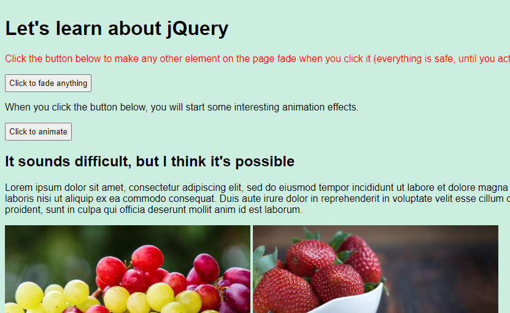

# HyperionDev Full Stack Web Development Bootcamp - Level 1 - Task 14 - Intro to jQuery

## Description
This task was my introduction to using jQuery to more easily make changes to the DOM and do event handling.

## Table of Contents
* [Instructions](#instructions)
* [Technologies](#technologies)
* [Installation](#installation)
* [Usage](#usage)
* [Credits](#credits) 

## Instructions
These were the instructions I was given to guide me in this task:

**Follow these steps:**

* Create a basic HTML file with a few basic elements.
* Import the jQuery library into your HTML document.
* Create a jQuery command that will create an alert once the page has loaded.
* Create a jQuery command that will change the background once the page has loaded.
* Create a jQuery function which changes only a single paragraph’s styling
* Create a jQuery function which fades out any object that is clicked on. (You’ll need to do a bit of research for this one.)
* Create a jQuery function which creates a drop-down menu with the use of an accordion animation style when each section is hovered over.
* Create a jQuery function which contains a chained effect to slide all the elements of your page around repeatedly whilst changing the background.
* Create a jQuery function which fades a picture in and out over a period of 3 seconds each when the respective buttons are clicked.
* Create a jQuery function which can stop the animation of the above effect whilst in progress.

### Technologies
This project uses:
* HTML 5 
* CSS 3
* Javascript ECMAScript 2021
* jQuery

## Installation
This project requires no special installation, as it is simply a webpage that used html, css and jQuery. Open the index.html file in your web browser.

## Usage 
This is a single page website with various buttons and animations. Simply click on the buttons and move your mouse over the various elements on the page to see what happens. See figure 1 below.

## Credits
This project was created by Evan Malherbe as part of a task for HyperioDev Full Stack Development Bootcamp November 2021 [GitHub profile](https://github.com/evanmalherbe) 
